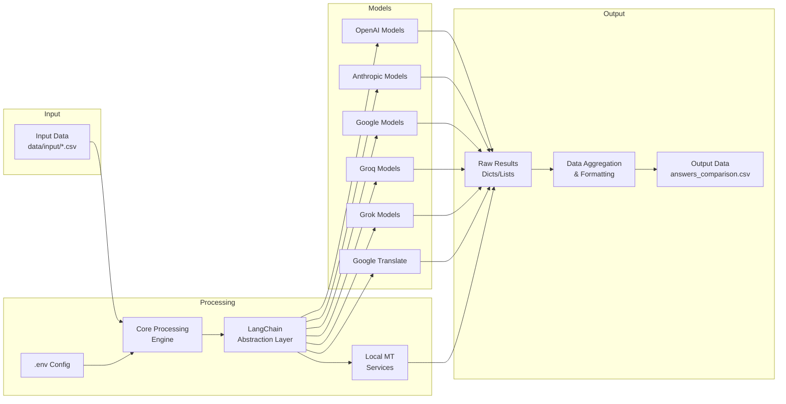

# Technical Approach & System Design: LLM Fluency Evaluation Framework

This document outlines the systematic procedure and technical design for evaluating and comparing the fluency of various Large Language Models (LLMs) and Machine Translation (MT) services. The framework is designed for flexibility, allowing evaluation across different languages and domains using a structured input dataset.

## 1. System Architecture Overview

The framework operates as a batch processing pipeline, orchestrated by Python scripts leveraging the LangChain library for standardized LLM interactions.

### 1.1. Architecture Diagram



**Core Principles:**

*   **Modularity**: Separate concerns for data input, model interaction, evaluation logic, and output generation.
*   **Extensibility**: Easily add new LLM providers or local MT services by implementing corresponding interface wrappers or API clients. LangChain facilitates this for many common providers.
*   **Configuration Driven**: API keys and potentially model choices are managed externally via `.env` files, avoiding hardcoding.
*   **Scalability**: Leverages parallel processing (`concurrent.futures`) to handle potentially large datasets and numerous model queries efficiently.

## 2. Key Components & Technologies

### 2.1. Project Structure (Illustrative)

```
langchain-multi-llm/
├── .env                 # API Keys & Configuration (Git Ignored)
├── .env.example         # Example for .env structure
├── .gitignore           # Specifies intentionally untracked files
├── APPROACH.md          # This document
├── README.md            # Project overview, setup, usage
├── requirements.txt     # Python dependencies
├── data/
│   ├── input/
│   │   └── template.csv # Example input data format
│   ├── answers_comparison.csv # Example output file
│   └── ... (other data files like digital-umuganda-mt-qna.csv)
├── evaluate_kinyarwanda_questions.py # Main script for Kinyarwanda evaluation
├── compare_llms.py       # Script focused on direct response comparison
├── multi_llm.py          # Original multi-LLM interaction example script
├── prompt_templates.py   # (Optional) Centralized prompt definitions
└── ... (other utility scripts like consolidate_qna.py)
```

### 2.2. Core Technologies

*   **Python**: The primary programming language.
*   **LangChain**: The central library for interacting with LLMs.
    *   **Role**: Provides a unified interface (`ChatOpenAI`, `ChatAnthropic`, `ChatGroq`, etc.) to interact with various LLM providers, simplifying API calls. Handles prompt templating (`ChatPromptTemplate`) and standardizes input/output schemas (`HumanMessage`, response objects). Enables easier swapping and addition of models.
*   **Pandas**: Used for data manipulation.
    *   **Role**: Efficiently reads input CSVs into DataFrames, facilitates data handling during processing, and structures the final aggregated results before writing to the output CSV.
*   **python-dotenv**: Manages environment variables.
    *   **Role**: Loads API keys and other configuration parameters from the `.env` file into the environment, keeping sensitive credentials separate from the codebase.
*   **concurrent.futures**: Enables parallel execution.
    *   **Role**: Significantly speeds up the process by making concurrent API calls to multiple LLMs for multiple questions, utilizing `ThreadPoolExecutor`.
*   **Requests / HTTP Clients**: For interacting with local MT services or APIs not directly supported by LangChain.
*   **Specific LLM SDKs**: Underlying libraries called by LangChain (e.g., `openai`, `anthropic`, `google-cloud-translate`).

### 2.3. Models & Services Integration

This section details the specific implementation for each model type used in the evaluation framework.

#### 2.3.1. OpenAI Models

OpenAI models are integrated using the LangChain `ChatOpenAI` class from the `langchain-openai` package.

```python
from langchain_openai import ChatOpenAI
from dotenv import load_dotenv
import os

load_dotenv()

# GPT-4o
gpt_4o = ChatOpenAI(
    model="gpt-4o",
    temperature=0.0,  # Set to 0 for more deterministic responses
    api_key=os.getenv("OPENAI_API_KEY"),
    max_tokens=1024
)

# GPT-3.5-Turbo (o3-mini)
gpt_o3_mini = ChatOpenAI(
    model="gpt-3.5-turbo",
    temperature=0.0,
    api_key=os.getenv("OPENAI_API_KEY"),
    max_tokens=1024
)

# GPT-4-Turbo (o1-preview)
gpt_o1_preview = ChatOpenAI(
    model="gpt-4-turbo",  # or the specific o1-preview model identifier
    temperature=0.0,
    api_key=os.getenv("OPENAI_API_KEY"),
    max_tokens=1024
)

# Add to models dictionary
models = {
    "gpt-4o": gpt_4o,
    "gpt-o3-mini": gpt_o3_mini,
    "gpt-o1-preview": gpt_o1_preview
}
```

#### 2.3.2. Anthropic/Claude Models

Claude models are integrated using the LangChain `ChatAnthropic` class from the `langchain-anthropic` package.

```python
from langchain_anthropic import ChatAnthropic

# Claude 3 Sonnet
claude_sonnet = ChatAnthropic(
    model="claude-3-sonnet-20240229",
    temperature=0,
    anthropic_api_key=os.getenv("ANTHROPIC_API_KEY"),
    max_tokens=1024
)

# Claude 3 Haiku
claude_haiku = ChatAnthropic(
    model="claude-3-haiku-20240307",
    temperature=0,
    anthropic_api_key=os.getenv("ANTHROPIC_API_KEY"),
    max_tokens=1024
)

# Add to models dictionary
models.update({
    "claude-sonnet-3": claude_sonnet,
    "claude-haiku-3": claude_haiku
})
```

#### 2.3.3. Google Models (Gemini)

Google Gemini models are integrated using the LangChain `ChatGoogleGenerativeAI` class from the `langchain-google-genai` package.

```python
from langchain_google_genai import ChatGoogleGenerativeAI

# Gemini Flash 2.0
gemini_flash = ChatGoogleGenerativeAI(
    model="gemini-flash-2.0",
    temperature=0,
    google_api_key=os.getenv("GOOGLE_API_KEY"),
    max_output_tokens=1024
)

# Gemini Pro
gemini_pro = ChatGoogleGenerativeAI(
    model="gemini-pro",
    temperature=0,
    google_api_key=os.getenv("GOOGLE_API_KEY"),
    max_output_tokens=1024
)

# Gemma (if available via Google API)
gemma = ChatGoogleGenerativeAI(
    model="gemma-7b",  # Adjust model name as per availability
    temperature=0,
    google_api_key=os.getenv("GOOGLE_API_KEY"),
    max_output_tokens=1024
)

# Add to models dictionary
models.update({
    "gemini-flash-2.0": gemini_flash,
    "gemini-pro": gemini_pro,
    "gemma": gemma
})
```

#### 2.3.4. Groq Models (Llama 4 and DeepSeek)

Groq models are integrated using the LangChain `ChatGroq` class from the `langchain-groq` package.

```python
from langchain_groq import ChatGroq

# Llama 4 via Groq
llama_4 = ChatGroq(
    model="llama4-8b-preview",  # Adjust based on available model names
    temperature=0,
    api_key=os.getenv("GROQ_API_KEY"),
    max_tokens=1024
)

# DeepSeek via Groq
deepseek = ChatGroq(
    model="deepseek-coder",  # Adjust based on available model names
    temperature=0,
    api_key=os.getenv("GROQ_API_KEY"),
    max_tokens=1024
)

# Add to models dictionary
models.update({
    "llama4-groq": llama_4,
    "deepseek-groq": deepseek
})
```

#### 2.3.5. Grok Models

For Grok models, integration depends on the available API. If Grok provides a direct API:

```python
# Custom implementation for Grok (example - adjust based on actual API)
from langchain.chat_models.base import BaseChatModel
from langchain.schema import ChatResult, BaseMessage, AIMessage
import requests

class ChatGrok(BaseChatModel):
    """Chat model for interacting with Grok API."""
    
    def __init__(self, api_key: str, model: str = "grok-3", temperature: float = 0):
        self.api_key = api_key
        self.model = model
        self.temperature = temperature
        super().__init__()
    
    def _generate(self, messages, stop=None, run_manager=None, **kwargs):
        headers = {
            "Authorization": f"Bearer {self.api_key}",
            "Content-Type": "application/json"
        }
        
        # Convert LangChain messages to Grok format
        grok_messages = [{"role": msg.type, "content": msg.content} for msg in messages]
        
        payload = {
            "model": self.model,
            "messages": grok_messages,
            "temperature": self.temperature
        }
        
        response = requests.post(
            "https://api.grok.ai/v1/chat/completions",  # Example URL, adjust as needed
            headers=headers,
            json=payload
        )
        
        if response.status_code != 200:
            raise Exception(f"Error from Grok API: {response.text}")
        
        result = response.json()
        return ChatResult(generations=[AIMessage(content=result["choices"][0]["message"]["content"])])

# Initialize Grok model
grok_3 = ChatGrok(
    api_key=os.getenv("GROK_API_KEY"),
    model="grok-3",
    temperature=0
)

# Add to models dictionary
models.update({
    "grok-3": grok_3
})
```

#### 2.3.6. Google Translate

Google Translate is integrated using the Google Cloud Translation API:

```python
from google.cloud import translate_v2 as translate
import os

# Initialize Google Translate client
# This assumes GOOGLE_APPLICATION_CREDENTIALS env var is set or credentials are provided
translate_client = translate.Client()

# Function to translate text using Google Translate
def google_translate(text, target_language="en"):
    """Translate text using Google Translate API."""
    try:
        result = translate_client.translate(
            text, 
            target_language=target_language
        )
        return result["translatedText"]
    except Exception as e:
        print(f"Error with Google Translate: {e}")
        return f"Error: {str(e)}"

# Wrapper function to match the LLM interface pattern
def google_translate_wrapper(question, language):
    """Wrapper to make Google Translate follow the same interface as other models."""
    translated_text = google_translate(question, target_language="en")
    return {
        "answer": translated_text,
        "model": "google-translate"
    }

# Add to models dictionary (as a function reference)
models.update({
    "google-translate": google_translate_wrapper
})
```

#### 2.3.7. Local MT Services (e.g., Digital Umuganda)

For local MT services like Digital Umuganda, integration depends on how the service is exposed:

```python
import requests

# Example API integration for Digital Umuganda MT service
def digital_umuganda_translate(text, source_language="rw", target_language="en"):
    """Translate text using Digital Umuganda MT API."""
    try:
        response = requests.post(
            "https://api.digitalumuganda.com/translate",  # Example URL, adjust as needed
            json={
                "text": text,
                "source": source_language,
                "target": target_language
            },
            headers={
                "Authorization": f"Bearer {os.getenv('DIGITAL_UMUGANDA_API_KEY')}",
                "Content-Type": "application/json"
            }
        )
        
        if response.status_code != 200:
            raise Exception(f"Error from Digital Umuganda API: {response.text}")
            
        result = response.json()
        return result["translation"]
    except Exception as e:
        print(f"Error with Digital Umuganda MT: {e}")
        return f"Error: {str(e)}"

# Wrapper function to match the LLM interface pattern
def digital_umuganda_wrapper(question, language):
    """Wrapper to make Digital Umuganda MT follow the same interface as other models."""
    translated_text = digital_umuganda_translate(
        question, 
        source_language=language, 
        target_language="en"
    )
    return {
        "answer": translated_text,
        "model": "digital-umuganda-mt"
    }

# Add to models dictionary (as a function reference)
models.update({
    "digital-umuganda-mt": digital_umuganda_wrapper
})
```

## 3. Detailed Workflow & Data Flow

*(This section expands on the previous procedural steps with more technical context)*

### 3.1. Input Data Processing

*   **Script**: Typically the main evaluation script (e.g., `evaluate_kinyarwanda_questions.py`).
*   **Action**: Uses `pandas.read_csv()` to load data from `data/input/*.csv`. Validates required columns (`question`, `language`, `topic`).

### 3.2. Environment and Model Setup

*   **Script**: Evaluation script.
*   **Action**:
    *   `load_dotenv()` reads `.env`.
    *   `initialize_models()` function:
        *   Checks `os.getenv()` for each required API key.
        *   Instantiates LangChain `Chat*` objects for configured cloud providers as shown in section 2.3.
        *   Instantiates clients for Google Translate and any custom local MT wrappers.
        *   Returns a dictionary mapping model names (e.g., `"gpt-4o"`) to their initialized client objects.

### 3.3. Parallel Query Execution

*   **Script**: Evaluation script.
*   **Action**:
    *   Uses `ThreadPoolExecutor` to manage a pool of worker threads.
    *   Iterates through input questions. For each question, submits tasks to the executor. Each task typically involves:
        *   Calling a function (e.g., `process_single_question`) that takes the question text and the dictionary of model clients.
        *   Inside this function, iterate through the model clients.
        *   For each model, call another function (e.g., `answer_question`) which:
            *   Formats the prompt using `ChatPromptTemplate` (passing the question and target language).
            *   Invokes the specific model client (`model.invoke(messages)`).
            *   Handles exceptions and extracts the answer text.
        *   Collects answers from all models for that single question.
    *   Uses `as_completed` or `executor.map` to gather results as tasks finish.

### 3.4. Aggregation and Output

*   **Script**: Evaluation script.
*   **Action**:
    *   Collects results from the parallel execution (often a list of dictionaries, each containing the original question, topic, and answers keyed by model name like `Answer_MODELNAME`).
    *   Converts this list into a `pandas` DataFrame.
    *   Ensures column names match the `Answer_MODELNAME` convention.
    *   Uses `df.to_csv(output_path, index=False, quoting=csv.QUOTE_ALL)` to write the final comparison file (e.g., `data/answers_comparison.csv`). `csv.QUOTE_ALL` is crucial to handle potential commas or quotes within the LLM answers correctly.

## 4. Execution and Monitoring

*   **Command**: `python evaluate_kinyarwanda_questions.py` (or relevant script).
*   **Monitoring**: The script should include print statements or logging to indicate:
    *   Initialization progress (models loaded).
    *   Start and end of processing.
    *   Progress updates (e.g., "Processed X out of Y questions").
    *   Errors encountered during API calls (including the model name and question that failed).
    *   Confirmation of output file generation.

This enhanced design provides a clearer picture of the system's architecture, the roles of its components and technologies, and the end-to-end data flow for evaluation.
